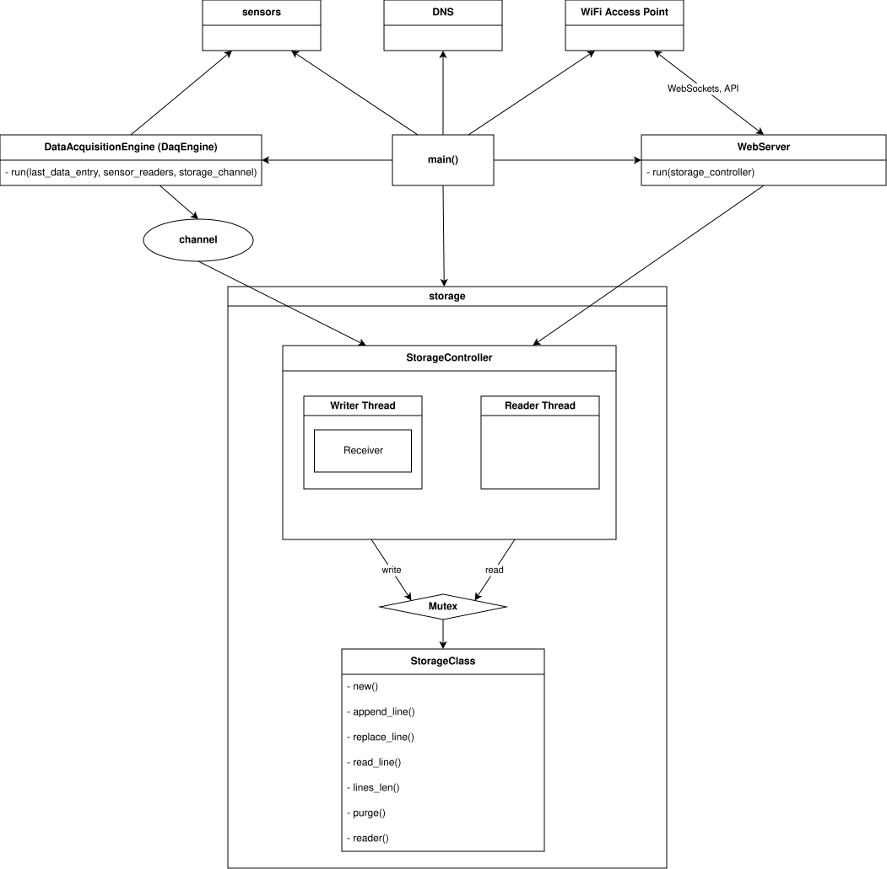
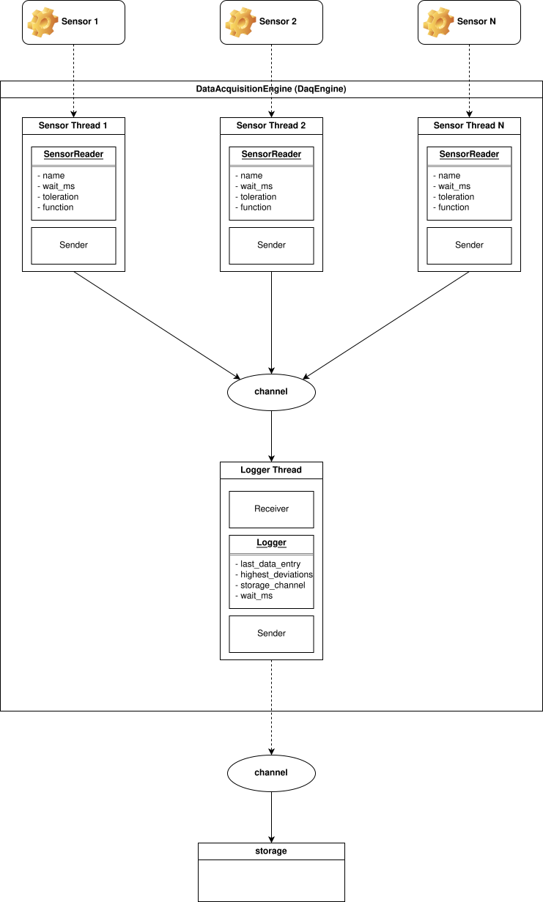
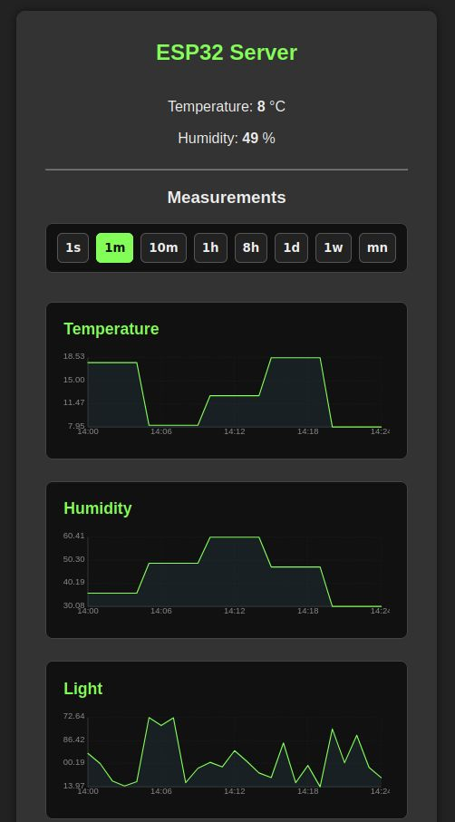
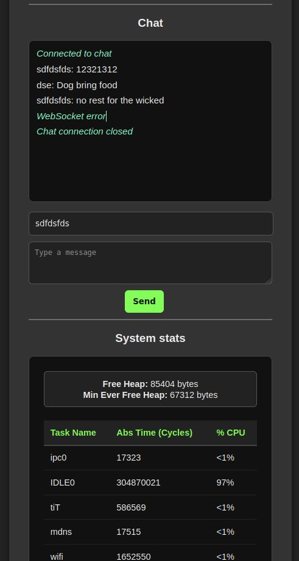

# 🦀 ESP32 & Rust Lab

An experimental sandbox for exploring the embedded Rust ecosystem on ESP32 microcontrollers. This repository contains hardware tests, proof-of-concept implementations using various crates.

Verified Hardware: LILYGO TTGO T8 V1.7 (ESP32-WROVER)

## Usage

build and flash to esp32
```
cargo espflash flash --monitor

cargo espflash flash --monitor --partition-table partitions.csv

cargo espflash flash --monitor --partition-table partitions.csv --baud 921600
```


## High-level system architecture

The architecture is modular and separates concerns between hardware interfacing, networking, application logic, and concurrent data persistence.



#### **main()** 

function is the application's entry point. Its primary role is to act as the central orchestrator, initializing the key software modules and establishing communication paths between them. It spawns the distinct concurrent components and passes necessary parameters to link them together.

#### **Web Server**

This is the external-facing engine. It creates the user and network interface for the device. It serves via API and WebSockets.

#### DNS & WIFI Access Point: 
These components are collectively part of the networking stack that the WebServer depends on to establish connectivity and communicate via protocols like WebSockets and a defined API

#### **storage** 

purpose is to encapsulate all logic and data related to data persistence, ensuring thread safety and data integrity. `StorageController` acts as the facade and orchestrator for the storage system, managing threads lifecycle:  

- **Writer Thread**: This thread holds a Receiver instance connected to `mpsc::channel`. It is dedicated to popping data off the channel and initiating a write operation to the storage media. 

- **Reader Thread**: This thread (implied here for servicing data read requests from the WebServer or elsewhere) is dedicated to managing read operations from the storage media. 

Both the Writer and Reader threads need to access the underlying storage class. To prevent race conditions and ensure thread safety, access is mediated by a `Mutex`.

**StorageClass**: This is the low-level data abstraction layer (DAL). It contains the raw data structure and defines a complete API for manipulating the stored data.

By implementing a `StorageClassTrait`, you can seamlessly swap out the underlying storage engine—switching from In-Memory storage (for testing/development) to Flash Storage (SPIFFS/FATFS) or an SD Card without changing a single line of code in your controller.


#### **Data Acquisition Engine (DaqEngine)**

Is built on a concurrent, multi-threaded pipeline designed to decouple high-frequency sensor reading from data logging and storage.



`DaqEngine` and the `storage` subsystem comunicate via `mpsc::channel`. This is a classical asynchronous, one-way message queue Multi-Producer Single-Consumer). This channel provides crucial decoupling: the DaqEngine does not need to wait for a slow storage operation (e.g., flash write) to complete before reading the next sensor value, enhancing system responsiveness.


**Sensor Threads (1 to N)**: Each physical or virtual sensor is isolated in its own dedicated execution thread to prevent blocking.

`SensorReader` houses the configuration and logic for reading from a sensor:

- `name`: Unique identifier for the sensor.

- `wait_ms`: The sampling interval (polling rate).

- `toleration`: The allowed variance or error margin for readings.

- `function`: The logic/callback used to pull raw data from the sensor.

`Sender`: Each thread owns a sending clone of a `mpsc::channel` to dispatch captured data.


**Logger Pipeline (LoggerThread)** a centralized thread that processes, filters, and prepares incoming sensor data.

Receiver: Listens to the consolidated stream of sensor data from the channel.

Logger: Aggregates and analyzes the incoming data stream:

- `last_data_entry`: Tracks the most recent state/reading.

- `highest_deviations`: Tracks anomalies or significant data spikes.

- `wait_ms`: The throttling or batching interval for outputting data.

- `storage_channel`: Reference to the outbound channel connected to storage.


`Sender`: Forwards the processed/filtered data to the final storage stage.


### UI

is few lines of bare JS + HTML + CSS stored in `src/assets/`.

Instead of reading the files from a filesystem at runtime—which incurs hardware read overhead — files are embedded directly into compiled Rust binary using.

This guarantees zero-cost runtime asset loading and ensures your UI is always packaged cleanly with your firmware.

UI requests sensor data from web server as csv:
```csv
timestamp,temperature,humidity,sound
1784185090,21.12312,30.3456,20.76543
1784185093,22.22222,40.4444,30.76543
```




## ESP32 specification

| **Core 0: PRO_CPU** (Protocol CPU) | **Core 1: APP_CPU** (Application CPU) |
| :--- | :--- |
| • Wi-Fi / Bluetooth Stacks | • Main Application Loop |
| • TCP/IP Network Layer | • Peripheral Control (SPI/I2C) |
| • System Event Handlers | • Math & Data Processing |
| • RTOS Background Tasks | • User Interface / Displays |   

**Core 0: PRO_CPU (Protocol CPU)**

Primary Role: Handles the heavy background heavy-lifting, specifically wireless communication and low-level hardware protocols.

**Core 1: APP_CPU (Application CPU)**

Primary Role: Dedicated entirely to execution of user code and application logic.

https://documentation.espressif.com/esp32-wrover-e_esp32-wrover-ie_datasheet_en.pdf


**how many threads can esp32 handle?**

The ESP32 can handle dozens of threads in Rust, limited primarily by its Available RAM rather than an arbitrary cap. While the ESP32 is a dual-core chip, you can comfortably create 30 to 40 threads (with 8K to 16K stack sizes) before running out of memory.

The exact thread threshold depends on a few key factors:

- RAM and Stack Size: Every thread needs its own stack allocation in memory. If you assign smaller stack sizes, you can spawn more threads.

- Available Cores: While you can create dozens of threads, the ESP32 can only physically execute 2 or 3 threads at the exact same time (depending on the specific ESP32 variant). The FreeRTOS scheduler will continuously context-switch the rest.

- Standard Library vs. Bare-Metal: In Rust, you can spawn threads using the std::thread module if you are using the esp-idf-std framework. For bare-metal implementations (using no_std), the embassy and RTIC frameworks are preferred for managing concurrency


## TODO:

- improve error handling

- add tests

- search in log file: from/to timestamp, binary search etc
